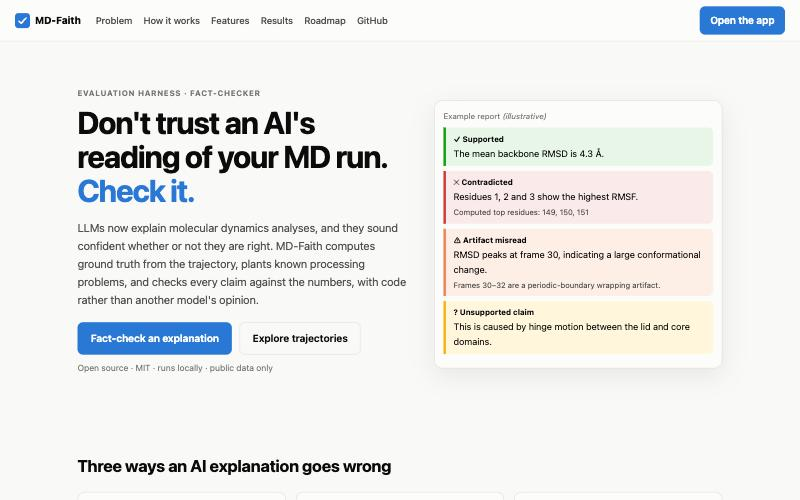
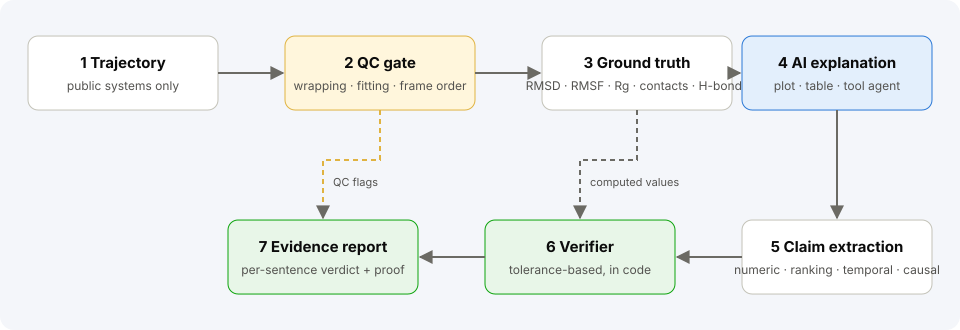
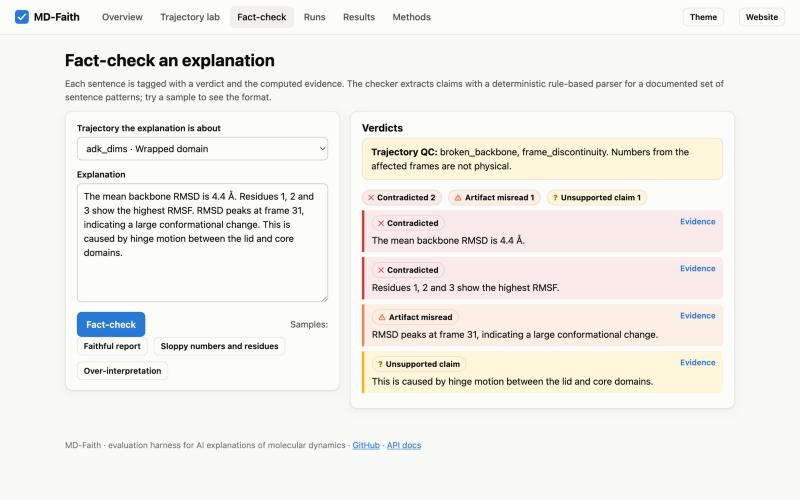
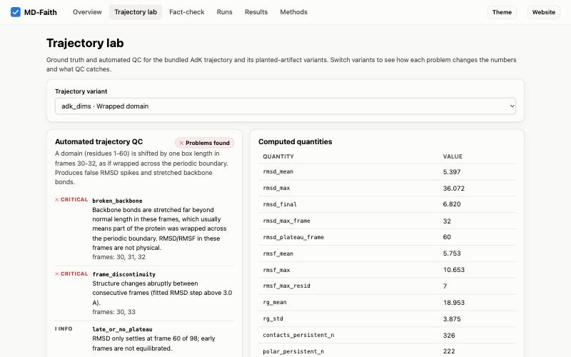
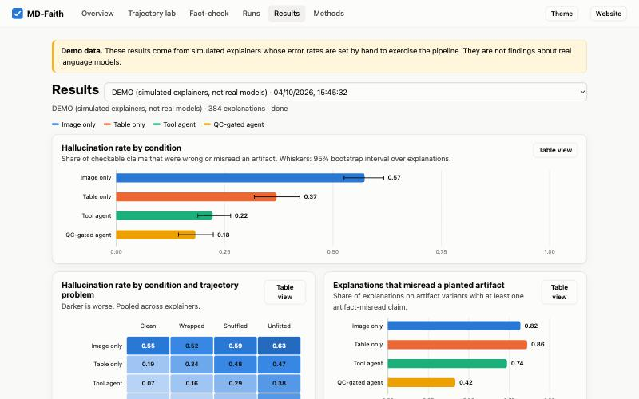
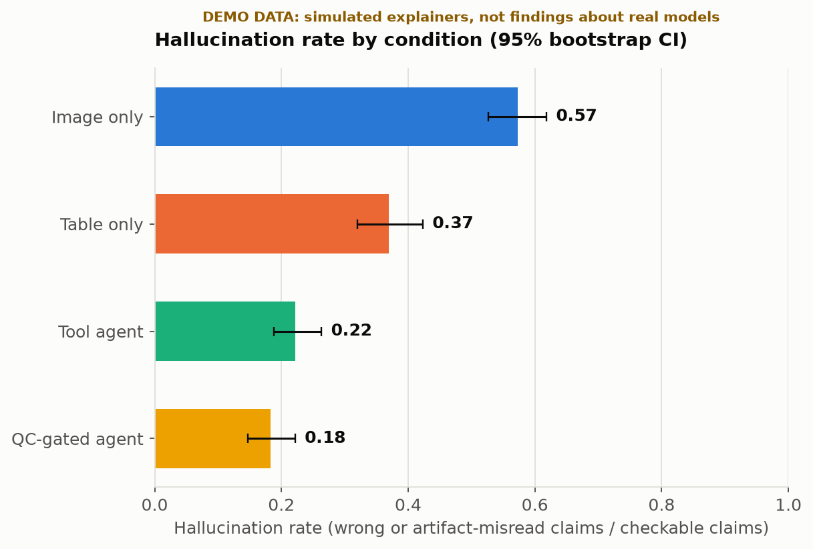
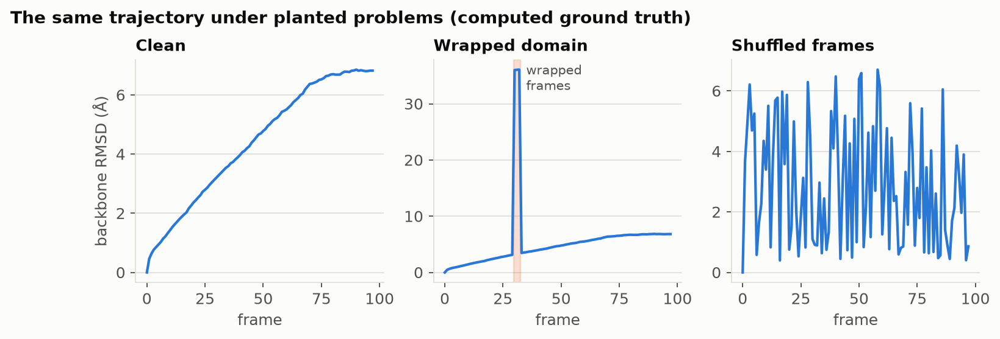
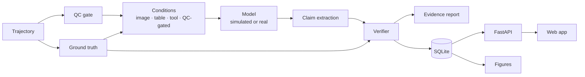

<div align="center">

# MD-Faith

**When an AI explains your molecular dynamics run, can you trust it?**

I built MD-Faith to find out. It computes ground truth from a trajectory, plants known processing problems in it, and checks every claim an AI makes against the numbers, using code rather than a second model's opinion.

[](https://github.com/nishatayub/md-faith/actions/workflows/ci.yml)
[](LICENSE)




</div>

---

## Why I built it

Language models now write the analysis section of an MD study: "the RMSD plateaus around frame 60, residues 149 to 151 are the most flexible, the loop opens through a hinge motion." They sound equally sure whether or not they are right. I wanted a way to measure that, so I started with the simplest question I could make precise:

> Which claims in an LLM's explanation of an MD analysis are faithful to the trajectory, and does giving the model tools, instead of a picture or a table, reduce the unfaithful ones?

Three failures kept coming up in how I thought about it:

| Failure | Example | What MD-Faith does |
|---|---|---|
| **Plausible but wrong numbers** | "Mean RMSD is about 2 Å" when it is 4.4 Å | Recomputes the value from coordinates and shows the real one |
| **Artifacts read as physics** | A domain wrapped across the periodic boundary reported as a conformational change | Plants such artifacts on purpose and flags explanations that misread them |
| **Mechanisms nobody measured** | "Caused by hinge motion", inferred from an RMSD curve | Flags causal claims that cite no computed evidence |

Agents such as MDCrow and DynaMate already run and explain simulations. What I could not find was a way to score whether those explanations hold up against the trajectory, so that is the gap this project fills.

## What I built

<p align="center"></p>

1. **A QC gate** that detects broken backbones, frame discontinuities, unfitted frames and scrambled frame order from coordinates alone.
2. **Ground truth** for RMSD, RMSF, radius of gyration, contact occupancy and distance-and-angle hydrogen bonds. I cross-checked RMSD and RMSF against MDAnalysis in the tests.
3. **Planted traps**: a wrapped domain, shuffled frames and an unfitted trajectory, each recording exactly which frames are affected.
4. **A claim verifier** for numeric, ranking, temporal and causal claims, with explicit tolerances.
5. **Evidence-linked reports**, where every sentence of an explanation is tagged and expands to the computed value, the tool that reproduces it and its definition.
6. **A benchmark runner** over conditions × models × artifacts × seeds, stored in SQLite, with bootstrap intervals.
7. **A web app and REST API** on top, plus a landing site.

| Verdict | Meaning |
|---|---|
| ✓ **Supported** | Matches the computed value within tolerance |
| ✕ **Contradicted** | Checkable and wrong; the real value is shown |
| ⚠ **Artifact misread** | Presents a processing artifact as physical motion |
| ? **Unsupported claim** | A mechanism stated without cited computed evidence |

## What it looks like

<table>
<tr>
<td width="50%"><br><sub><b>Fact-check.</b> Paste an explanation and each sentence gets a verdict with evidence. QC warns when the trajectory itself is broken.</sub></td>
<td width="50%"><br><sub><b>Trajectory lab.</b> Ground truth and QC for the bundled AdK trajectory and its planted-artifact variants.</sub></td>
</tr>
<tr>
<td colspan="2"><br><sub><b>Results.</b> Hallucination rate with 95% intervals and heatmaps. <b>This is a demo run with simulated explainers, not a finding.</b></sub></td>
</tr>
</table>

## Run it yourself

```bash
git clone https://github.com/nishatayub/md-faith.git
cd md-faith
python -m venv .venv && source .venv/bin/activate
pip install -e ".[dev,api]"

mdfaith demo     # seed a clearly labelled demo run
mdfaith serve    # website at http://127.0.0.1:8000, app at /app
```

There is also a `Dockerfile` and `docker-compose.yml`. I have not built the image yet (see *Limits*).

A few other entry points:

```bash
mdfaith qc --artifact pbc_split          # QC flags the wrapped frames
mdfaith figures --out docs/figures       # figures and tables from the latest run
pytest -q                                # the test suite
```

| Task | Where |
|---|---|
| Fact-check a pasted explanation | App → **Fact-check**, or `POST /api/verify` |
| Inspect ground truth and QC | App → **Trajectory lab**, or `GET /api/tasks/{id}` |
| Run a simulated grid | App → **Runs**, or `mdfaith run --models sim-careful,sim-hasty` |
| Run a real model | `mdfaith run --models anthropic:<model> --seeds 3` (needs credentials and spends API credit) |

Real-model runs are CLI-only by default. The API refuses them unless `MDFAITH_ALLOW_REAL=1`, so a hosted instance cannot spend credit by accident.

## What the demo shows, and what it doesn't

**I have not run experiments with real language models yet.** Everything in the dashboards and in the figure below comes from *simulated* explainers whose error rates I set by hand to exercise the pipeline. That image-only explanations look worst and QC-gated ones best is built into those settings, so it is not a result.

<p align="center"></p>

The one figure that is real involves no model at all. It is the computed RMSD of the same trajectory under each planted problem:

<p align="center"></p>

The wrapped domain produces a spike that looks like dramatic motion but is a processing error, which is exactly the trap I want explanations tested against. I track every placeholder that still needs a real result in [`docs/FINDINGS_TODO.md`](docs/FINDINGS_TODO.md).

## Design decisions I made

- **No LLM judges truth.** Anything checkable against a trajectory is checked by code. A language model appears only as the thing being evaluated and, optionally, as the claim extractor, which I plan to validate by hand.
- **Simulation is labelled everywhere.** The `is_demo` flag is stored on each run and drives the UI banner and the figure stamp.
- **No silent model fallback.** My model adapter does not switch to another model on a refusal, because that would contaminate per-model results. A refusal is recorded as a refusal.
- **SQLite and plain Python.** One file, easy to inspect and share, enough for this scale.
- **A front end with no build step.** Plain ES modules and hand-written SVG charts, with all dynamic text inserted through DOM text nodes so pasted explanations cannot inject markup.

The full architecture, including the lifecycle of a single claim and the data model, is in [`docs/ARCHITECTURE.md`](docs/ARCHITECTURE.md).



## How I tested it

- A test suite covering ground truth, artifacts, QC, the verifier, the store, the runner, the API, the web assets and the figures. RMSD and RMSF are checked against MDAnalysis's own implementations.
- Continuous integration on Python 3.10, 3.11 and 3.12 for every pull request.
- A clean, non-editable install in a fresh environment to confirm the web assets ship with the package.
- I used the web app in a browser end to end, which turned up two bugs I then fixed (a `null` rendered in the verdict panel and overlapping heatmap labels).

## How I organised the work

I built it as twelve features, each in its own pull request, ordered by what depends on what.

| # | Feature | What it adds |
|---|---|---|
| F01 | Repository foundation | Licence, CI, lint, templates, contributing guide |
| F02 | Trajectory QC engine | Detectors for wrapping, discontinuity, unfitted frames, scrambled order; QC-gated condition |
| F03 | Hydrogen-bond ground truth | Distance and angle criteria, per-frame counts, residue-pair occupancy |
| F04 | SQLite store | Runs, explanations, claims and verdicts |
| F05 | Evidence-linked reports | Sentence-level verdicts with computed evidence; rule-based extractor |
| F06 | Model layer | Labelled simulated explainers, a real-model adapter, tool-loop plumbing |
| F07 | Experiment runner | Grid runner, bootstrap aggregation, demo seeding |
| F08 | REST API | Verification, tasks, runs, summaries, explanation reports |
| F09 | Web app | Trajectory lab, fact-check, runs, results, methods |
| F10 | Landing website | Product page with honest placeholders |
| F11 | Figures and diagrams | Figures pipeline, architecture docs, poster template, findings registry |
| F12 | Packaging and docs | Docker, this README, changelog |

## Limits

- Simulated results are not findings. The demo error rates are invented to exercise the pipeline.
- Only one public system (AdK) is bundled. Conclusions about other systems need more systems, including at least one that is not famous, since models may recite the literature.
- The artifacts are synthetic, and my tolerances (10% numeric, 5-frame window, 60% residue overlap) are defaults that need a sensitivity analysis.
- If an LLM does the claim extraction, I still have to validate it by hand on a random subset before any result is reported.
- Causal statements cannot be checked from a trajectory alone, so they are reported separately as unsupported mechanisms.
- The real-model adapter has only been tested against a fake client, not a live API.
- The Docker image has not been built or run; the Docker daemon was not available when I wrote it.

## What's next

- [ ] Smoke-test the real-model adapter against a live API
- [ ] Hand-validate claim extraction on at least 100 claims
- [ ] Add two more public systems
- [ ] Run real-model experiments, a tolerance sensitivity analysis, and replace the placeholder figures
- [ ] Stretch: train a hidden-state probe that flags unsupported MD claims

## Licence and citing

MIT licensed, see [LICENSE](LICENSE). Citation metadata is in [CITATION.cff](CITATION.cff). Contribution notes are in [CONTRIBUTING.md](CONTRIBUTING.md). I only use public data; unpublished trajectories do not belong in this repository.
