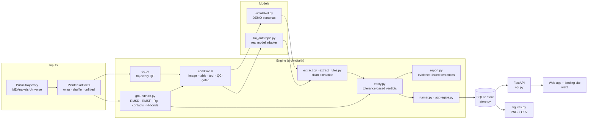
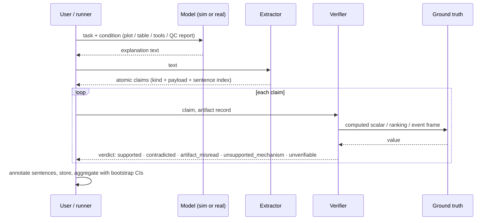
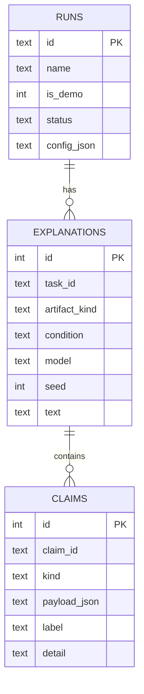

# Architecture

MD-Faith is a small Python package (`src/mdfaith`) with a FastAPI service and a dependency-free web front end.
Everything that decides whether a claim is true is plain, tested code that reads coordinates.

## System view

## One claim, end to end

## Data model

## Module map

| Module | Responsibility |
|---|---|
| `groundtruth.py` | Fixed definitions of every checkable quantity (cross-checked against MDAnalysis in tests) |
| `artifacts.py` | Planted problems with a record of exactly which frames are affected |
| `qc.py` | Detectors that find those problems from coordinates alone |
| `claims.py`, `verify.py` | Claim schema and programmatic verification with explicit tolerances |
| `extract.py`, `extract_rules.py` | LLM claim extraction (real runs) and a deterministic grammar parser (offline/demo) |
| `report.py` | Sentence-level annotation with computed evidence and definitions |
| `conditions/`, `tools.py`, `render.py` | What the model is shown: plots, tables, or analysis tools |
| `simulated.py`, `llm_anthropic.py`, `llm.py` | Explainers: labelled simulations and a real adapter behind one interface |
| `runner.py`, `aggregate.py`, `metrics.py` | Experiment grid, bootstrap statistics |
| `store.py` | SQLite persistence |
| `api.py`, `web/` | REST API, app and landing site |
| `figures.py` | Publication-style figures; demo runs are stamped |

## Decisions worth knowing

1. **No LLM judge for truth.** Anything checkable against a trajectory is checked by code. LLMs appear only as the thing being evaluated and, optionally, as the claim extractor (which must be validated by hand).
2. **Simulated explainers are labelled everywhere.** `is_demo` is stored on the run and drives the UI banner and figure stamp. Real runs never set it.
3. **No silent model fallback.** The Anthropic adapter does not enable server-side refusal fallbacks, because switching models mid-evaluation would contaminate per-model results; refusals are recorded as such.
4. **SQLite, plain `sqlite3`.** One file, no server, trivial to inspect and share; fine at this scale.
5. **Vanilla JS front end.** No build step, nothing to audit beyond the repository; all dynamic text goes through DOM text nodes.
6. **Real-model runs are CLI-only by default.** The API refuses them unless `MDFAITH_ALLOW_REAL=1`, so a public instance cannot spend credit.
7. **Honest statistics.** Intervals come from a bootstrap over explanations; with one system they describe replicate variability, not variability across systems.
